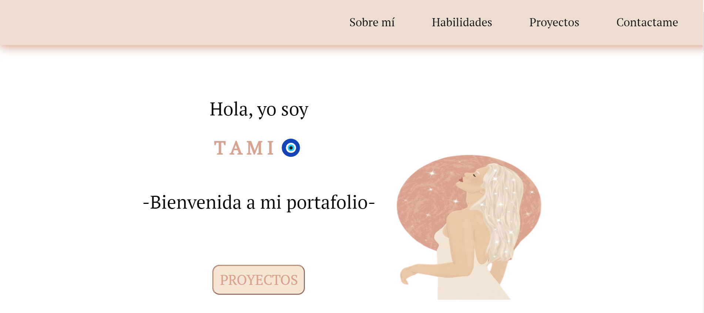
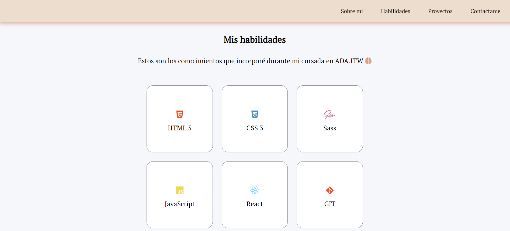
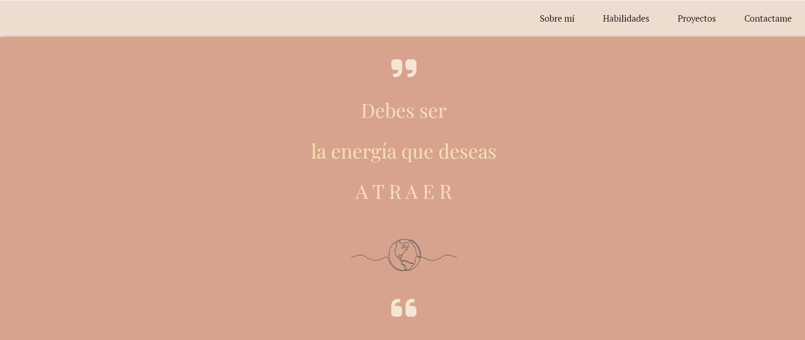
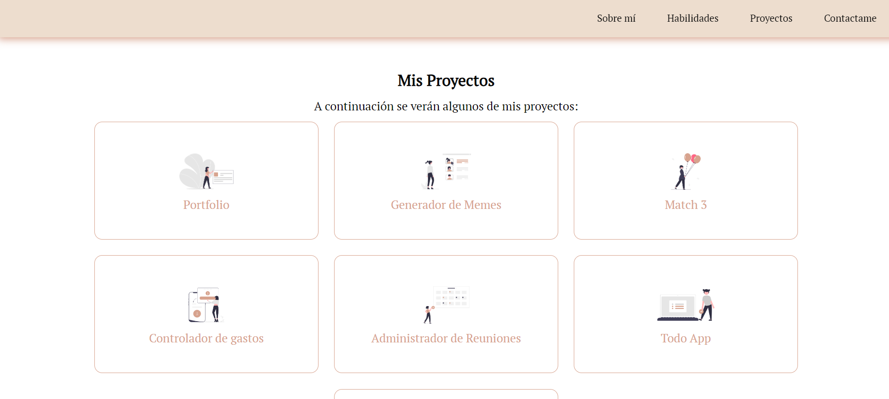
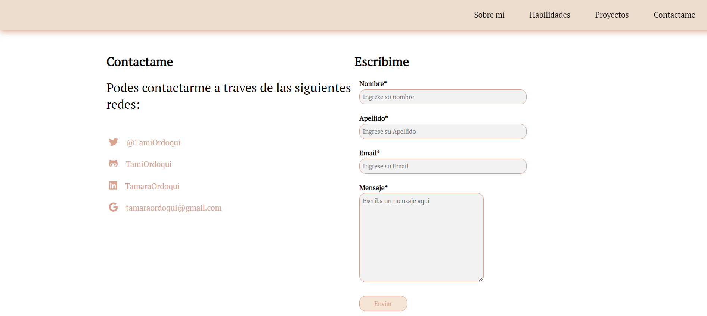

# MiPortfolio

Este es mi primer Portfolio, donde muestro las habilidades que adquirí durante los primeros meses de cursada en AdaItw. Esta dividido por secciones, donde se podrá ver informacion de mis conocimientos, proyectos, como contactarme y demás! 💕

## Secciones 

### Sobre mi:
Inicio de mi portfolio, donde me presento y te doy la bienvenida. Además, agregué una imagen y un botón para que puedas ver mis proyectos! 

### Mis Habilidades : 
En esta sección están las herramientas que aprendí / aprenderé durante lo largo de mi cursada.

🛠️ Habilidades: 

- HTML 
- CSS
- SASS
- JAVASCRIPT
- REACT
- GIT

### Quote :
⭐ Frase que me gusta y me repito a diario.

### Mis Proyectos:
Los siguientes proyectos son los que realicé para avanzar a través de los modulos en AdaITW. 

🔆Mis Proyectos: 

- Portfolio
- Generador de memes
- Match 3
- Controlador de gastos
- Administrador de reuniones
- Todo App
- Buscador de películas

### Contacto:
📩 A continuación se verán los medios por donde podrás contactarme, si así lo deseas.

## Avance de mi proyecto :
Mi portfolio irá creciendo a medida que avance mi cursada. Los proyectos que realizaré se incluirán es su seccion correspondiente, así como también agregaré funcionalidades para que sea un portfolio profesional.

## Licencia : 
Este proyecto es realizado por Tamara Ordoqui, todos los derechos son reservados. 

Hecho con 💓 y dedicación.

